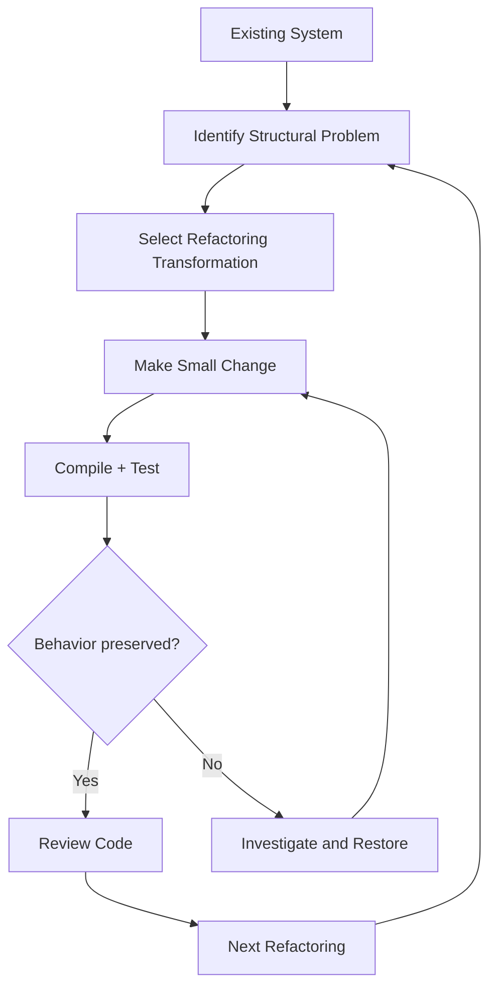

# Code Refactoring — Detailed Documentation

A structured reference guide to code refactoring: what it is, why and when to do it, a categorized catalog of refactoring techniques with before/after examples, and practical guidance for applying refactoring safely in real projects.

## Table of Contents

- **Part I — Foundations of Refactoring**
- 1. Introduction
- 2. What Is Code Refactoring?
  - 2.1 Definition
- 3. Refactoring vs. Rewriting
- 4. Why Is Refactoring Important?
  - 4.1 Improve Software Design
  - 4.2 Counter Code Decay
  - 4.3 Increase Comprehensibility
  - 4.4 Find Bugs and Improve Robustness
  - 4.5 Improve Long-Term Productivity
  - 4.6 Reduce Maintenance Costs
  - 4.7 Prepare for Future Customization
- 5. When Should Code Be Refactored?
  - 5.1 The Rule of Three
- 6. Refactoring During Feature Development
- 7. Refactoring During Bug Fixing
- 8. Refactoring and Agile Development
- 9. When Should You Avoid Refactoring?
  - 9.1 When a Rewrite Is More Appropriate
  - 9.2 Immediately Before a Critical Deadline
- 10. Refactoring and Technical Debt
- 11. Major Categories of Refactoring
- **Part II — Catalog of Refactoring Techniques**
- Category I — Decomposing and Composing Methods
  - Extract Method
  - Inline Method
  - Inline Temp
  - Replace Temp with Query
  - Introduce Explaining Variable
  - Split Temporary Variable
  - Remove Assignments to Parameter
  - Replace Method with Method Object
  - Substitute Algorithm
- Category II — Moving Features Between Objects
  - Move Method
  - Move Field
  - Extract Class
  - Inline Class
  - Hide Delegate
  - Remove Middle Man
  - Introduce Foreign Method
  - Introduce Local Extension
- Category III — Organizing Data
  - Encapsulate Field
  - Replace Data Value with Object
  - Change Value to Reference
  - Change Reference to Value
  - Replace Array with Object
  - Replace Magic Number with Symbolic Constant
  - Encapsulate Collection
  - Replace Type Code with Subclass
  - Replace Type Code with State or Strategy
  - Replace Subclass with Fields
- Category IV — Simplifying Conditional Expressions
  - Decompose Conditional
  - Consolidate Conditional Expression
  - Consolidate Duplicate Conditional Fragments
  - Remove Control Flag
  - Replace Nested Conditional with Guard Clauses
  - Replace Conditional with Polymorphism
  - Introduce Null Object
  - Introduce Assertion
- Category V — Dealing with Generalization
  - Push Down Method
  - Pull Up Method
  - Extract Superclass
  - Collapse Hierarchy
  - Form Template Method
  - Replace Inheritance with Delegation
- Category VI — Simplifying Method Calls
  - Rename Method
  - Add Parameter
  - Remove Parameter
  - Separate Query from Modifier
  - Parameterize Method
  - Replace Parameter with Method
  - Replace Parameter with Explicit Methods
  - Preserve Whole Object
  - Introduce Parameter Object
  - Remove Setting Method
  - Hide Method
  - Replace Constructor with Factory Method
  - Replace Error Code with Exception
  - Replace Exception with Test
- **Part III — Applying Refactoring in Practice**
- 72. Relationships Between Refactorings
- 73. A Practical Refactoring Workflow
  - Step 1 — Understand the Existing Code
  - Step 2 — Identify the Structural Problem
  - Step 3 — Choose a Small Refactoring
  - Step 4 — Make One Structural Change
- 74. Testing During Refactoring
- 75. Refactoring and Version Control
- 76. Common Code Smells That Suggest Refactoring
  - Long Method
  - Large Class
  - Duplicate Code
  - Long Parameter List
  - Feature Envy
  - Primitive Obsession
  - Switch / Conditional Complexity
  - Shotgun Surgery
- 77. Refactoring and Object-Oriented Design
  - High Cohesion
  - Low Coupling
  - Encapsulation
- 78. Refactoring and Design Patterns
- 79. Refactoring in Modern Software Projects
- 80. Refactoring in API and Backend Systems
- **Part IV — Guidelines, Reference, and Conclusion**
- 81. Refactoring Does Not Mean "Changing Everything"
- 82. Refactoring Checklist
- 83. Refactoring Decision Guide
- 84. Key Principles of Code Refactoring
- 85. Overall Conceptual Model
- 86. Conclusion

---

## Part I — Foundations of Refactoring

## 1. Introduction

Software systems continuously evolve. New features are added, bugs are fixed, requirements change, and existing components are reused in new ways. Over time, this continuous modification can cause the internal structure of a codebase to deteriorate. Code may become difficult to understand, duplicated, tightly coupled, unnecessarily complex, or expensive to modify.

**Code refactoring** is a disciplined approach to improving the internal structure of existing software while preserving its externally observable behavior. The central idea is to make the code **easier to understand, maintain, extend, test, and modify without intentionally changing what the software does**.

The material is organized around three major areas:

1. **Refactoring basics**  
2. **Categories of refactorings**  
3. **Warnings and situations where refactoring should be approached carefully**

The source particularly emphasizes small, incremental refactorings and presents numerous transformations for methods, objects, data, conditionals, inheritance, and method interfaces.

---

## 2. What Is Code Refactoring?

### 2.1 Definition

A refactoring can be understood as a **software transformation that preserves external behavior while improving internal structure**.

In practical terms:

> **Refactoring changes how code works internally, not what users observe externally.**

For example, suppose a method calculates the total price of an order. The calculation can be reorganized into several smaller methods, variables can be renamed, duplicated logic can be removed, or responsibilities can be moved between classes. As long as the externally observable behavior remains unchanged, these are refactoring activities.

**Core characteristics:**

A proper refactoring generally has two simultaneous objectives:

* **Behavior preservation**  
  * Existing functionality should continue to behave as before.  
  * Existing inputs should produce equivalent outputs.  
  * Existing externally observable side effects should remain consistent unless the refactoring explicitly targets them.  
* **Structural improvement**  
  * Improve readability.  
  * Reduce duplication.  
  * Improve modularity.  
  * Reduce unnecessary coupling.  
  * Make future changes easier.

The source describes refactoring as restructuring software through a sequence of refactorings without changing its observable behavior, usually to make the software easier to understand and modify.

---

## 3. Refactoring vs. Rewriting

Refactoring should not be confused with rewriting software.

**Refactoring:**

```text
Existing Code
↓
Small Structural Changes
↓
Behavior Preserved
↓
Improved Internal Design
```

**Rewriting:**

```text
Existing Code
↓
Discard / Replace
↓
New Implementation
↓
Potentially Different Behavior
```

A refactoring normally works **inside the existing system**, gradually improving its structure.

A complete rewrite may be appropriate when the existing implementation is so problematic that improving it incrementally would be more difficult than creating a replacement. The source specifically identifies this as one situation where refactoring may not be appropriate.

---

## 4. Why Is Refactoring Important?

The source identifies several reasons for refactoring.

### 4.1 Improve Software Design

A codebase may gradually lose the quality of its original design as developers continuously add features and fixes.

Refactoring restores structure by:

* reducing unnecessary complexity,  
* improving class responsibilities,  
* removing duplication,  
* improving abstraction,  
* improving relationships between components.

---

### 4.2 Counter Code Decay

Software can experience **code decay** or software ageing.

As requirements change, the original architecture may no longer match the current system. Without structural maintenance, modifications tend to make the system increasingly difficult to understand.

Refactoring helps keep the codebase "in shape."

---

### 4.3 Increase Comprehensibility

Readable code reduces the cognitive effort required for developers to understand it.

For example:

```java
if ((platform.toUpperCase().indexOf("MAC") > -1) &&
    (browser.toUpperCase().indexOf("IE") > -1) &&
    wasInitialized() &&
    resize > 0) {
    // action
}
```

can be made easier to understand by introducing meaningful intermediate variables:

```java
final boolean isMacOS =
platform.toUpperCase().indexOf("MAC") > -1;
final boolean isIEBrowser =
browser.toUpperCase().indexOf("IE") > -1;
final boolean wasResized = resize > 0;
if (isMacOS && isIEBrowser &&
    wasInitialized() && wasResized) {
    // action
}
```

The logic is essentially unchanged, but the purpose of each condition is clearer. This corresponds to the **Introduce Explaining Variable** refactoring discussed in the source.

---

### 4.4 Find Bugs and Improve Robustness

Refactoring makes code easier to understand. Better understanding can make defects easier to locate.

For example, if a 200-line method performs validation, database access, calculations, formatting, and error handling, identifying the source of a bug can be difficult.

Breaking it into focused methods can make the problematic behavior easier to isolate.

The source explicitly identifies finding bugs and writing more robust code as a reason for refactoring.

---

### 4.5 Improve Long-Term Productivity

Refactoring may temporarily require development effort, but its purpose is to improve productivity over the longer term.

A clean codebase makes it easier to:

* understand existing functionality,  
* implement new features,  
* fix bugs,  
* review code,  
* test components,  
* onboard developers,  
* modify existing components.

The source emphasizes that the productivity benefit is a **long-term rather than short-term** benefit.

---

### 4.6 Reduce Maintenance Costs

Poorly structured software generally becomes more expensive to maintain.

Refactoring can reduce maintenance costs by making changes more localized and reducing unnecessary dependencies.

The source also associates refactoring with reducing testing effort in contexts where automated refactorings are guaranteed to preserve behavior.

---

### 4.7 Prepare for Future Customization

Refactoring can prepare an application for future requirements.

For example, if several components currently contain hard-coded behavior, extracting common abstractions can make future customization easier.

The source also identifies refactoring as a way to:

* facilitate future customizations,  
* turn an object-oriented application into a framework,  
* introduce design patterns while preserving behavior.

---

## 5. When Should Code Be Refactored?

Refactoring should generally be performed **continuously and incrementally**, rather than being treated as a special activity performed once every few months.

The source recommends:

> Refactor whenever there is a need and perform it in small bursts rather than on a predetermined periodic schedule.

---

### 5.1 The Rule of Three

The source presents the **Rule of Three**:

**First time:**

Implement the functionality normally.

**Second time:**

If something similar is required, duplication may occur.

**Third time:**

Instead of duplicating the implementation again, refactor the common structure.

```text
1st occurrence → Implement
2nd occurrence → Similar implementation / possible duplication
3rd occurrence → Refactor commonality
```

This is a practical heuristic for identifying when repeated structure has become significant enough to justify abstraction.

---

## 6. Refactoring During Feature Development

Refactoring is especially useful when adding a new feature.

If a new feature is unusually difficult to integrate, the difficulty may indicate that the existing structure does not adequately support the new behavior.

The source recommends refactoring when:

* adding features,  
* integrating difficult functionality,  
* fixing difficult-to-trace bugs,  
* conducting code reviews.

A useful development cycle is:

```text
Understand
↓
Implement
↓
Test
↓
Refactor
↓
Test Again
↓
Continue
```

---

## 7. Refactoring During Bug Fixing

Sometimes a bug is difficult to locate because the code itself is difficult to understand.

Instead of immediately changing random lines, developers can first improve the structure.

For example:

```text
Complex Method
↓
Extract meaningful operations
↓
Clarify conditions
↓
Separate responsibilities
↓
Locate defect
↓
Fix defect
```

The source explicitly recommends refactoring first when a bug is particularly difficult to trace because increased comprehensibility can make the defect easier to locate.

---

## 8. Refactoring and Agile Development

Refactoring fits naturally into agile development because agile development emphasizes maintaining simplicity and continuously adapting software.

The source connects refactoring with the principle of **maintaining simplicity** by actively eliminating unnecessary complexity from the system.

A practical interpretation is:

```text
Add functionality
↓
System becomes more complex
↓
Identify unnecessary complexity
↓
Refactor
↓
Restore simplicity
```

---

## 9. When Should You Avoid Refactoring?

Refactoring is valuable, but it is not automatically appropriate in every situation.

### 9.1 When a Rewrite Is More Appropriate

If the existing code is so severely damaged that incremental refactoring would be harder than rebuilding it, rewriting may be more appropriate.

The source explicitly identifies this situation.

---

### 9.2 Immediately Before a Critical Deadline

The source warns against major refactoring when the team is too close to a deadline because the productivity benefits may appear only after the deadline.

This does not mean that developers should never clean up code near a deadline. Small, low-risk improvements may still be reasonable. The main concern is introducing broad structural changes when there is insufficient time to validate them.

---

## 10. Refactoring and Technical Debt

**Technical debt** refers to the future cost created by choosing or accumulating implementations that make future changes more difficult.

Refactoring and technical debt are closely related.

```text
Short-term implementation decisions
↓
Technical debt
↓
Increasing complexity
↓
Higher maintenance cost
↓
Refactoring
↓
Reduced structural complexity
```

Refactoring does not necessarily eliminate all technical debt. Instead, it is one of the primary engineering mechanisms for managing and reducing structural debt.

Examples include:

* removing duplication,  
* simplifying complex methods,  
* improving abstractions,  
* reducing unnecessary coupling,  
* clarifying interfaces,  
* restructuring inheritance.

---

## 11. Major Categories of Refactoring

The source divides refactorings into several major categories.

**Small Refactorings:**

The material groups small refactorings into:

1. **Decomposing and composing methods**  
2. **Moving features between objects**  
3. **Organizing data**  
4. **Simplifying conditional expressions**  
5. **Dealing with generalization**  
6. **Simplifying method calls**

The source lists dozens of individual transformations across these categories.

**Big Refactorings:**

Examples include:

* Tease Apart Inheritance  
* Extract Hierarchy  
* Convert Procedural Design to Objects  
* Separate Domain from Presentation

These larger transformations can affect significant portions of a system and therefore generally require more planning and validation.

---

## Part II — Catalog of Refactoring Techniques

## Category I — Decomposing and Composing Methods

This category focuses on improving method structure.

The source identifies nine refactorings in this category:

1. Extract Method  
2. Inline Method  
3. Inline Temp  
4. Replace Temp with Query  
5. Introduce Explaining Variable  
6. Split Temporary Variable  
7. Remove Assignments to Parameter  
8. Replace Method with Method Object  
9. Substitute Algorithm

---

### Extract Method

**Definition:**

When a fragment of code can be grouped together, move it into a separate method with a name that explains its purpose.

**Before:**

```java
public void accept(Packet p) {
    if ((p.getAddressee() == this) &&
        (this.isASCII(p.getContents()))) {
        this.print(p);
    } else {
        super.accept(p);
    }
}
```

**After:**

```java
public void accept(Packet p) {
    if (isDestFor(p)) {
        this.print(p);
    } else {
        super.accept(p);
    }
}
public boolean isDestFor(Packet p) {
    return (p.getAddressee() == this) &&
    (this.isASCII(p.getContents()));
}
```

**Benefits:**

* Improves readability.  
* Gives a meaningful name to a complex operation.  
* Encourages reuse.  
* Reduces duplication.  
* Makes future refactoring easier.

The source specifically notes that local variables must be considered when applying this transformation.

---

### Inline Method

**Inline Method** is effectively the opposite of Extract Method.

When the method body is already as clear as its name, the method can be removed and its body placed directly into the caller. This reduces unnecessary indirection and delegation.

**Before:**

```java
int getRating() {
    return moreThanFiveLateDeliveries();
}
boolean moreThanFiveLateDeliveries() {
    return numberOfLateDeliveries > 5;
}
```

**After:**

```java
int getRating() {
    return numberOfLateDeliveries > 5;
}
```

**Purpose:**

Use it when a method provides little abstraction and simply redirects to a trivial expression.

---

### Inline Temp

**Inline Temp** removes a temporary variable when it is assigned once with a simple expression and the variable makes further refactoring harder.

**Before:**

```java
double basePrice = anOrder.basePrice();
return basePrice > 100;
```

**After:**

```java
return anOrder.basePrice() > 100;
```

This reduces unnecessary local state.

---

### Replace Temp with Query

When a temporary variable stores the result of an expression, the expression can be extracted into a method and references to the temporary can be replaced by calls to that method.

**Before:**

```java
double basePrice = quantity * itemPrice;
if (basePrice > 1000)
return basePrice * 0.95;
else
return basePrice * 0.98;
```

**After:**

```java
if (basePrice() > 1000)
return basePrice() * 0.95;
else
return basePrice() * 0.98;
double basePrice() {
    return quantity * itemPrice;
}
```

**Main benefit:**

The calculation becomes a named concept that can be reused.

---

### Introduce Explaining Variable

A complex expression can be assigned to a temporary variable whose name explains its meaning.

**Before:**

```java
if ((platform.toUpperCase().indexOf("MAC") > -1) &&
    (browser.toUpperCase().indexOf("IE") > -1) &&
    wasInitialized() &&
    resize > 0) {
    // action
}
```

**After:**

```java
final boolean isMacOS = ...;
final boolean isIEBrowser = ...;
final boolean wasResized = resize > 0;
if (isMacOS &&
    isIEBrowser &&
    wasInitialized() &&
    wasResized) {
    // action
}
```

The variables communicate **intent**, not merely implementation.

---

### Split Temporary Variable

If a temporary variable is assigned multiple times for different purposes, it should be split into separate variables.

**Poor structure:**

```java
double temp = 2 * (height + width);
System.out.println(temp);
temp = height * width;
System.out.println(temp);
```

**Refactored:**

```java
final double perimeter = 2 * (height + width);
System.out.println(perimeter);
final double area = height * width;
System.out.println(area);
```

This makes each variable represent one concept.

---

### Remove Assignments to Parameter

Assigning a new value directly to a method parameter can make the code harder to understand, particularly because developers may confuse parameter reassignment with changes to the original argument. The source recommends using a temporary variable instead.

**Before:**

```java
int discount(int inputVal, int quantity, int yearToDate) {
    if (inputVal > 50)
    inputVal -= 2;
    // ...
}
```

**After:**

```java
int discount(int inputVal, int quantity, int yearToDate) {
    int result = inputVal;
    if (inputVal > 50)
    result -= 2;
    // ...
}
```

---

### Replace Method with Method Object

Sometimes a large method contains many local variables, making it difficult to extract parts of the method into separate methods.

The solution is to turn the method into its own object and move the relevant local variables into fields of that object.

Conceptually:

```text
Large Method
├── local variable A
├── local variable B
├── local variable C
└── large computation
↓
Method Object
├── field A
├── field B
├── field C
└── compute()
```

This can transform an excessively complicated procedure into a more manageable object.

---

### Substitute Algorithm

When an existing algorithm is unnecessarily complicated, it can be replaced by a clearer alternative while preserving the behavior.

**General pattern:**

```text
Old Algorithm
↓
Understand behavior
↓
Design equivalent clearer algorithm
↓
Replace implementation
↓
Test behavior
```

The important requirement is that the replacement algorithm must preserve the intended behavior.

---

## Category II — Moving Features Between Objects

This category addresses misplaced responsibilities between classes.

The source identifies eight refactorings:

1. Move Method  
2. Move Field  
3. Extract Class  
4. Inline Class  
5. Hide Delegate  
6. Remove Middle Man  
7. Introduce Foreign Method  
8. Introduce Local Extension

---

### Move Method

A method should generally be moved when it uses more features of another class than the class in which it currently resides.

The source describes creating the method in the other class, removing or delegating the original method, and redirecting references.

**Principle:**

```text
Method is strongly related to Class B
↓
Currently located in Class A
↓
Move Method
↓
Method belongs to Class B
```

This improves responsibility assignment.

---

### Move Field

The same principle can apply to data fields.

If a field is primarily used by another class, moving it closer to the behavior that operates on it can improve cohesion.

Together, **Move Method** and **Move Field** are fundamental refactorings because they correct misplaced responsibilities.

---

### Extract Class

When one class performs work that logically belongs to two different classes, create a new class and move the relevant fields and methods into it.

**Before:**

```text
Person
├── name
├── officeAreaCode
├── officeNumber
├── homeAreaCode
├── homeNumber
├── getOfficePhone()
└── getHomePhone()
```

**After:**

```text
Person
├── name
├── phone
├── getOfficePhone()
└── getHomePhone()
PhoneNumber
├── areaCode
├── number
└── getPhoneNumber()
```

**Benefits:**

* Smaller classes.  
* Higher cohesion.  
* Clearer responsibilities.  
* Easier maintenance.

---

### Inline Class

**Inline Class** is the reverse of Extract Class.

When a class does very little, its features can be moved into another class and the unnecessary class can be removed.

This is particularly useful when previous refactorings leave behind a class that no longer provides meaningful responsibility.

---

### Hide Delegate

If a client directly accesses a delegate object through another object, the server can provide a method that hides the delegate.

**Before:**

```java
person.getDepartment().getManager();
```

**After:**

```java
person.getManager();
```

The client no longer needs to understand the internal relationship between `Person` and `Department`.

**Benefit:**

**Improved encapsulation.**

---

### Remove Middle Man

**Remove Middle Man** is the opposite situation.

If a class provides excessive simple delegation, the client can call the delegate directly.

This removes unnecessary layers of indirection.

The two transformations therefore represent opposite design problems:

| Refactoring | Problem |
| ----- | ----- |
| Hide Delegate | Client knows too much about internal structure |
| Remove Middle Man | Too much unnecessary delegation |

---

### Introduce Foreign Method

Sometimes a class needs an additional method but cannot be modified.

In this situation, the client can define a method that receives an instance of the original class as its first argument.

Example:

```java
Date nextDay(Date arg) {
    return new Date(
        arg.getYear(),
        arg.getMonth(),
        arg.getDate() + 1
    );
}
```

This provides an additional operation without changing the original class.

---

### Introduce Local Extension

When a server class requires several additional methods but cannot be modified, a separate extension class can contain those methods.

The source describes implementing this through mechanisms such as subclassing or wrapping.

This is particularly useful for third-party or library classes.

---

## Category III — Organizing Data

The source lists 16 refactorings related to data organization.

These include:

1. Encapsulate Field  
2. Replace Data Value with Object  
3. Change Value to Reference  
4. Change Reference to Value  
5. Replace Array with Object  
6. Duplicate Observed Data  
7. Change Unidirectional Association to Bidirectional  
8. Change Bidirectional Association to Unidirectional  
9. Replace Magic Number with Symbolic Constant  
10. Encapsulate Collection  
11. Replace Record with Data Class  
12. Replace Subclass with Fields  
13. Replace Type Code with Class  
14. Replace Type Code with Subclass  
15. Replace Type Code with State  
16. Replace Type Code with Strategy

---

### Encapsulate Field

If a class exposes a field publicly, make it private and provide controlled access through methods.

**Before:**

```java
public String name;
```

**After:**

```java
private String name;
public String getName() {
    return this.name;
}
public void setName(String name) {
    this.name = name;
}
```

**Why?:**

Encapsulation allows the internal representation to change without necessarily changing the external interface.

It improves:

* modularity,  
* maintainability,  
* control over state,  
* future extensibility.

---

### Replace Data Value with Object

A primitive or simple data value may eventually become important enough to deserve its own object.

For example:

```java
String phoneNumber;
```

may eventually become:

```java
PhoneNumber phoneNumber;
```

The new object can contain:

* validation,  
* formatting,  
* parsing,  
* comparison,  
* related behavior.

This moves behavior closer to the data it operates on.

---

### Change Value to Reference

This refactoring changes an object from an independent value into a shared reference.

**Value semantics:**

Two equivalent objects may independently represent the same value.

**Reference semantics:**

Multiple parts of the application refer to the same shared object.

This can be useful when identity and shared state matter.

---

### Change Reference to Value

The reverse transformation converts a shared reference into an independent value.

This is useful when:

* identity is unnecessary,  
* immutability is desirable,  
* shared state creates unnecessary coupling.

---

### Replace Array with Object

If different positions in an array represent different concepts, an object with named fields is usually easier to understand.

**Before:**

> customer[0]
> customer[1]
> customer[2]

**After:**

> customer.name
> customer.address
> customer.balance

Named concepts are easier to understand than unexplained indexes.

---

### Replace Magic Number with Symbolic Constant

A **magic number** is a literal numeric value whose meaning is not immediately clear.

**Before:**

```java
if (status == 3) {
    ...
}
```

**After:**

```java
final int APPROVED = 3;
if (status == APPROVED) {
    ...
}
```

This makes the intent explicit and reduces the risk of inconsistent values.

---

### Encapsulate Collection

Instead of exposing an internal collection directly, provide controlled access.

**Risky:**

```java
public List<Order> orders;
```

External code can potentially modify internal state freely.

**Better:**

```java
private List<Order> orders;
public List<Order> getOrders() {
    return Collections.unmodifiableList(orders);
}
```

The exact implementation depends on the language and design requirements, but the principle is to protect object state.

---

### Replace Type Code with Subclass

Sometimes an integer or enumeration represents different types and directly controls different behaviors.

For example:

```text
Employee
├── type = Engineer
├── type = Salesman
└── type = Manager
```

If the type determines behavior through conditionals, subclasses can represent the different behaviors.

```text
Employee
├── Engineer
├── Salesman
└── Manager
```

The source describes replacing the coded type with subclasses and moving relevant behavior into them, thereby replacing conditional control flow with polymorphism.

---

### Replace Type Code with State or Strategy

Subclassing is not always appropriate.

For example, if an object's type can change during its lifetime, subclassing may not represent the real behavior.

The source specifically gives changing employee types, such as promotion, as an example where subclassing may not be appropriate. In such cases, **State** or **Strategy** can be used.

**Strategy:**

```text
Employee
↓
EmployeeType
├── EngineerStrategy
├── SalesStrategy
└── ManagerStrategy
```

The behavior can change by replacing the strategy object rather than changing the class of the employee.

---

### Replace Subclass with Fields

If subclasses differ only in methods that return constant data, the subclasses may be unnecessary.

The source suggests moving those values into fields of the superclass and eliminating the subclasses.

This simplifies an inheritance hierarchy when inheritance does not provide meaningful behavioral variation.

---

## Category IV — Simplifying Conditional Expressions

The source identifies eight refactorings for conditional expressions:

1. Decompose Conditional  
2. Consolidate Conditional Expression  
3. Consolidate Duplicate Conditional Fragments  
4. Remove Control Flag  
5. Replace Nested Conditional with Guard Clauses  
6. Replace Conditional with Polymorphism  
7. Introduce Null Object  
8. Introduce Assertion

---

### Decompose Conditional

Complex conditions can be separated into named methods or variables.

**Before:**

```java
if (date.before(SUMMER_START) ||
    date.after(SUMMER_END)) {
    ...
}
```

**Conceptually:**

```java
if (isWinterPeriod()) {
    ...
}
```

The name communicates the business concept instead of forcing readers to interpret the implementation.

---

### Consolidate Conditional Expression

If several conditional expressions lead to the same result, they can be consolidated.

**Before:**

```java
if (age < 18) return false;
if (isBlocked) return false;
if (!verified) return false;
```

**Conceptually:**

```java
if (isIneligible()) return false;
```

This should only be done when combining the conditions does not hide important distinctions.

---

### Consolidate Duplicate Conditional Fragments

If identical code appears in multiple branches, move the common portion outside the conditional.

**Before:**

```java
if (condition) {
    doA();
    save();
} else {
    doB();
    save();
}
```

**After:**

```java
if (condition) {
    doA();
} else {
    doB();
}
save();
```

This eliminates duplicated behavior.

---

### Remove Control Flag

A control flag is often a variable used to determine whether a loop or method should continue.

Excessive use can make control flow difficult to follow.

Instead of:

```java
boolean found = false;
for (...) {
    if (...) {
        found = true;
    }
}
if (found) {
    ...
}
```

a direct return or more expressive control structure may be clearer.

---

### Replace Nested Conditional with Guard Clauses

Deeply nested conditions can often be replaced with early exits.

**Before:**

```java
if (employee != null) {
    if (employee.isActive()) {
        if (employee.hasPermission()) {
            performAction();
        }
    }
}
```

**After:**

```java
if (employee == null) return;
if (!employee.isActive()) return;
if (!employee.hasPermission()) return;
performAction();
```

This makes the main successful path easier to identify.

---

### Replace Conditional with Polymorphism

When conditional behavior depends on object type, polymorphism can replace repeated conditionals.

**Conditional approach:**

```java
if (employee.type == ENGINEER) {
    ...
} else if (employee.type == SALESMAN) {
    ...
} else if (employee.type == MANAGER) {
    ...
}
```

**Polymorphic approach:**

```text
Employee
├── Engineer
├── Salesman
└── Manager
```

Each class implements the relevant behavior.

This is closely connected with **Replace Type Code with Subclass** discussed in the source.

---

### Introduce Null Object

Instead of repeatedly checking for `null`, a special object representing the absence of a real object can sometimes be introduced.

**Conventional approach:**

```java
if (customer != null) {
    customer.sendInvoice();
}
```

**Null Object approach:**

```java
customer.sendInvoice();
```

where `customer` can safely refer to a `NullCustomer` implementation.

This is useful when the absence of an object has predictable behavior.

---

### Introduce Assertion

Assertions explicitly document assumptions that should always be true at a particular point in the program.

```java
assert amount >= 0;
```

Assertions can make assumptions visible and help detect violated invariants during development and testing.

---

## Category V — Dealing with Generalization

The source identifies several inheritance-related refactorings:

1. Push Down Method  
2. Push Down Field  
3. Pull Up Method  
4. Pull Up Field  
5. Pull Up Constructor Body  
6. Extract Subclass  
7. Extract Superclass  
8. Extract Interface  
9. Collapse Hierarchy  
10. Form Template Method  
11. Replace Inheritance with Delegation  
12. Replace Delegation with Inheritance

---

### Push Down Method

If a method in a superclass is relevant only to certain subclasses, move it down into those subclasses.

**Before:**

```text
Employee
└── getQuota()
Engineer
Salesman
```

If `getQuota()` only applies to `Salesman`:

**After:**

```text
Employee
Engineer
Salesman
└── getQuota()
```

This prevents unrelated subclasses from inheriting irrelevant behavior.

---

### Pull Up Method

If multiple subclasses contain essentially the same behavior, move the common method into their superclass.

The source describes looking for methods with the same name or, more importantly, methods with equivalent behavior.

**Before:**

```text
ASCIIPrinter
└── accept()
PSPrinter
└── accept()
```

If both methods contain common behavior:

**After:**

```text
PrintServer
└── accept()
ASCIIPrinter
PSPrinter
```

This reduces duplication.

---

### Extract Superclass

When multiple classes contain sufficiently similar features, common functionality can be extracted into a superclass.

The source illustrates this through classes such as `PrintServer` and `FileServer`, where common behavior can be represented by a more general `OutputServer`.

**General structure:**

```text
Before:
Class A
├── common feature
└── specific feature
Class B
├── common feature
└── specific feature
After:
CommonSuperclass
└── common feature
/            \\
Class A        Class B
specific       specific
```

---

### Collapse Hierarchy

If a superclass and subclass no longer have meaningful differences, they can be combined.

This prevents unnecessary inheritance depth.

---

### Form Template Method

When subclasses perform similar algorithms with some steps that vary, a common algorithm can be placed in the superclass while variable steps are implemented by subclasses.

```text
Superclass
└── common algorithm
├── step A
├── variable step
└── step C
Subclass A → implementation of variable step
Subclass B → implementation of variable step
```

This is a classic application of inheritance for algorithm structure.

---

### Replace Inheritance with Delegation

Inheritance should not automatically be used whenever two classes are related.

If the relationship is not truly an **is-a** relationship, delegation or composition may provide a better structure.

**Inheritance:**

> Car extends Engine

This implies a car **is an engine**, which is conceptually incorrect.

**Delegation:**

```text
Car
└── Engine
```

The car **has an engine** and delegates engine-related operations to it.

This often reduces coupling and makes relationships more explicit.

---

## Category VI — Simplifying Method Calls

The source identifies 15 refactorings in this category:

1. Rename Method  
2. Add Parameter  
3. Remove Parameter  
4. Separate Query from Modifier  
5. Parameterize Method  
6. Replace Parameter with Method  
7. Replace Parameter with Explicit Methods  
8. Preserve Whole Object  
9. Introduce Parameter Object  
10. Remove Setting Method  
11. Hide Method  
12. Replace Constructor with Factory Method  
13. Encapsulate Downcast  
14. Replace Error Code with Exception  
15. Replace Exception with Test

---

### Rename Method

Method names should clearly communicate what the method does.

**Poor:**

```java
process();
```

**Better:**

```java
calculateMonthlyRevenue();
```

A meaningful method name reduces the need to inspect implementation details.

---

### Add Parameter

Sometimes a method requires additional information to perform its responsibility.

> calculateSalary()

may become:

> calculateSalary(employeeId)

The change should be made carefully because adding parameters can also increase coupling.

---

### Remove Parameter

If a method no longer needs a parameter, remove it.

**Before:**

> calculateTotal(orderId, userId, unusedFlag)

**After:**

> calculateTotal(orderId, userId)

Unused parameters create confusion and suggest responsibilities that do not actually exist.

---

### Separate Query from Modifier

A method should ideally not both:

1. return information, and  
2. unexpectedly modify state.

For example, separating:

> calculateBalance()

from:

> updateBalance()

can make behavior more predictable.

This improves reasoning, testing, and reuse.

---

### Parameterize Method

If several methods perform essentially the same operation but differ only by a value, they can sometimes be combined into a parameterized method.

**Before:**

> fivePercentDiscount()
> tenPercentDiscount()

**After:**

> applyDiscount(percentage)

This reduces duplicated implementation.

---

### Replace Parameter with Method

If a parameter is always derived from information already available to the object, the method may calculate it itself rather than requiring the caller to supply it.

This reduces unnecessary knowledge required by callers.

---

### Replace Parameter with Explicit Methods

If a parameter exists mainly to choose between substantially different behaviors, separate named methods may be clearer.

**Before:**

```java
process("invoice");
process("payment");
```

**Potentially clearer:**

```java
processInvoice();
processPayment();
```

Explicit method names can communicate intent better than control parameters.

---

### Preserve Whole Object

Instead of extracting several individual values from an object and passing them separately:

```java
process(
    customer.getName(),
    customer.getAddress(),
    customer.getPhone()
);
```

consider passing the whole object:

```java
process(customer);
```

when the receiving method genuinely needs the object as a conceptual unit.

---

### Introduce Parameter Object

When the same group of parameters repeatedly appears across methods, those parameters can be replaced with a dedicated object.

The source gives a date range as an example.

**Before:**

> amountInvoicedIn(from, to)
> amountReceivedIn(from, to)
> amountOverdueIn(from, to)

**After:**

> amountInvoicedIn(dateRange)
> amountReceivedIn(dateRange)
> amountOverdueIn(dateRange)

where:

```java
class DateRange {
    Date from;
    Date to;
}
```

**Benefits:**

* Fewer parameters.  
* Stronger semantic meaning.  
* Easier validation.  
* Easier extension.  
* Reduced repetition.

---

### Remove Setting Method

If an object's field should not be changed after initialization, a setter may be unnecessary.

Instead of:

```java
person.setId(123);
```

the value can be established during construction:

```java
Person person = new Person(123);
```

This can support immutability and stronger object invariants.

---

### Hide Method

If a method is not required outside its class, reduce its visibility.

For example:

```java
public calculateInternalValue()
```

may become:

```java
private calculateInternalValue()
```

when external callers do not need access.

This reduces the public API surface.

---

### Replace Constructor with Factory Method

Constructors can sometimes become difficult to understand when there are multiple ways to create an object.

Instead of:

```java
new User(true, false, "ADMIN")
```

a factory method can express intent:

> User.createAdministrator()

The factory method can encapsulate construction logic and provide meaningful names.

---

### Replace Error Code with Exception

The source specifically discusses replacing special return values used for errors with exceptions.

**Before:**

```java
int withdraw(int amount) {
    if (amount > balance)
    return -1;
    else {
        balance -= amount;
        return 0;
    }
}
```

**After:**

```java
void withdraw(int amount) throws BalanceException {
    if (amount > balance)
    throw new BalanceException();
    balance -= amount;
}
```

**Why?:**

This clearly separates:

> Normal processing
> from
> Error processing

The source identifies this separation as the principal motivation.

---

### Replace Exception with Test

Exceptions should not normally be used for ordinary expected control flow when the condition can be checked directly.

For example, rather than:

```java
try {
    accessResource();
} catch (NotAvailableException e) {
    ...
}
```

when availability can be reliably checked beforehand:

```java
if (resourceAvailable()) {
    accessResource();
}
```

This makes expected conditions explicit.

---

## Part III — Applying Refactoring in Practice

## 72. Relationships Between Refactorings

Many refactorings are opposites or natural complements.

| Refactoring | Related / Opposite Refactoring |
| ----- | ----- |
| Extract Method | Inline Method |
| Inline Temp | Replace Temp with Query |
| Extract Class | Inline Class |
| Hide Delegate | Remove Middle Man |
| Push Down Method | Pull Up Method |
| Push Down Field | Pull Up Field |
| Replace Type Code with Subclass | Replace Subclass with Fields |
| Replace Inheritance with Delegation | Replace Delegation with Inheritance |
| Introduce Parameter Object | Remove unnecessary parameters |
| Replace Error Code with Exception | Replace Exception with Test |

Understanding these relationships makes it easier to identify which transformation fits a particular design problem.

---

## 73. A Practical Refactoring Workflow

A safe refactoring process can be structured as follows.

### Step 1 — Understand the Existing Code

Before modifying anything:

* identify the responsibility of the code,  
* understand its dependencies,  
* identify callers,  
* understand its inputs and outputs,  
* inspect existing tests.

---

### Step 2 — Identify the Structural Problem

Look for signs such as:

* duplicated code,  
* very long methods,  
* large classes,  
* unclear names,  
* deeply nested conditionals,  
* excessive parameters,  
* inappropriate responsibilities,  
* unnecessary inheritance,  
* public mutable state,  
* excessive delegation,  
* repeated type checks.

---

### Step 3 — Choose a Small Refactoring

Do not attempt to redesign the entire system immediately.

Choose a targeted transformation such as:

```text
Long Method
→ Extract Method
Duplicate Logic
→ Extract Method / Parameterize Method
Large Class
→ Extract Class
Wrong Responsibility
→ Move Method / Move Field
Complex Conditional
→ Decompose Conditional / Guard Clauses
Type-Based Conditional
→ Polymorphism / Strategy
Repeated Parameters
→ Parameter Object
```

---

### Step 4 — Make One Structural Change

Perform one transformation at a time.

For example:

```text
Extract Method
↓
Compile
↓
Run Tests
↓
Next Refactoring
```

This makes failures easier to diagnose.

---

## 74. Testing During Refactoring

Because the objective of refactoring is behavior preservation, testing is extremely important.

A practical loop is:

```text
Existing Code
↓
Run Tests
↓
Refactor
↓
Run Tests
↓
Compare Behavior
↓
Continue
```

**Useful testing levels:**

* Unit tests  
* Integration tests  
* API tests  
* Regression tests  
* End-to-end tests  
* Snapshot tests where appropriate

The stronger the test suite, the safer it is to perform structural changes.

---

## 75. Refactoring and Version Control

Refactoring should ideally be separated into understandable commits.

For example:

```text
Commit 1:
Extract Order.calculateSubtotal()
Commit 2:
Rename calculateTotal() → calculateGrandTotal()
Commit 3:
Move pricing logic to PricingService
```

Avoid mixing a large refactoring with unrelated feature development when possible.

This makes code review and debugging easier.

---

## 76. Common Code Smells That Suggest Refactoring

Although the source focuses primarily on refactoring transformations, practical refactoring is often triggered by **code smells**.

Common examples include:

### Long Method

A method performs too many operations.

**Possible refactoring:** Extract Method.

---

### Large Class

A class contains too many unrelated responsibilities.

**Possible refactoring:** Extract Class.

---

### Duplicate Code

The same logic appears in multiple places.

**Possible refactoring:** Extract Method, Pull Up Method, or Parameterize Method.

---

### Long Parameter List

A method requires many parameters.

**Possible refactoring:** Introduce Parameter Object.

---

### Feature Envy

A method depends heavily on another class's data.

**Possible refactoring:** Move Method.

---

### Primitive Obsession

Important concepts are represented only by primitive values.

**Possible refactoring:** Replace Data Value with Object.

---

### Switch / Conditional Complexity

Behavior changes according to type codes or repeated conditions.

**Possible refactoring:** Replace Conditional with Polymorphism, Strategy, or State.

---

### Shotgun Surgery

A single conceptual change requires modifications in many unrelated places.

**Possible refactoring:** Move Method, Move Field, Extract Class, or improve encapsulation.

---

## 77. Refactoring and Object-Oriented Design

Many of the transformations in the source are fundamentally concerned with object-oriented design principles.

### High Cohesion

A class should have closely related responsibilities.

```text
Good:
Invoice
├── calculateTotal()
├── calculateTax()
└── applyDiscount()
```

rather than:

```text
Invoice
├── calculateTotal()
├── sendEmail()
├── generatePDF()
├── authenticateUser()
└── connectToDatabase()
```

---

### Low Coupling

Classes should avoid unnecessary dependencies on one another.

Refactorings such as:

* Hide Delegate,  
* Move Method,  
* Move Field,  
* Extract Class,  
* Introduce Parameter Object

can help control coupling.

---

### Encapsulation

Internal state should be protected behind meaningful interfaces.

The source explicitly connects field encapsulation with increased modularity and the ability to change internal representation without modifying the external interface.

---

## 78. Refactoring and Design Patterns

Refactoring can also be used to introduce design patterns incrementally.

For example:

```text
Repeated conditional behavior
↓
Replace Conditional with Polymorphism
↓
Strategy / State / Subclass structure
```

Similarly:

```text
Complex object construction
↓
Replace Constructor with Factory Method
↓
Factory-based creation
```

The source explicitly identifies refactoring as a way to introduce design patterns while preserving behavior.

---

## 79. Refactoring in Modern Software Projects

In practical modern development, refactoring can be applied to:

* backend services,  
* frontend applications,  
* APIs,  
* machine-learning pipelines,  
* data-processing systems,  
* microservices,  
* mobile applications,  
* databases and data-access layers,  
* infrastructure code.

For example, an ML pipeline might initially contain:

> load_data()
> preprocess()
> train()
> evaluate()
> save_model()

inside one enormous function.

Refactoring could separate responsibilities into:

> DataLoader
> Preprocessor
> Trainer
> Evaluator
> ModelSerializer

while maintaining the same pipeline behavior.

The same principle applies: **improve internal structure without intentionally changing the externally expected behavior.**

---

## 80. Refactoring in API and Backend Systems

Consider an API endpoint:

```text
POST /orders
↓
Validate request
↓
Calculate price
↓
Apply discount
↓
Save order
↓
Send email
↓
Return response
```

If all of this is implemented in one controller method, it becomes difficult to maintain.

Refactoring might produce:

```text
OrderController
↓
OrderService
↓
PricingService
↓
OrderRepository
↓
NotificationService
```

Each component has a clearer responsibility.

However, excessive abstraction should also be avoided. Refactoring is not simply about creating more classes; it is about improving the structure of the system.

---

## Part IV — Guidelines, Reference, and Conclusion

## 81. Refactoring Does Not Mean "Changing Everything"

One of the most important practical principles is **incremental change**.

Poor approach:

> "I will redesign the entire application."

Better approach:

```text
Identify one structural problem
↓
Apply one refactoring
↓
Test
↓
Review
↓
Apply the next refactoring
```

This aligns with the source's emphasis on performing refactoring continuously in small bursts.

---

## 82. Refactoring Checklist

Before refactoring:

* Understand the current behavior.  
* Identify the specific structural problem.  
* Check available tests.  
* Understand dependencies.  
* Determine whether the change is actually necessary.

During refactoring:

* Make small changes.  
* Preserve behavior.  
* Keep names meaningful.  
* Avoid unrelated modifications.  
* Compile frequently.  
* Run tests frequently.

After refactoring:

* Run the complete relevant test suite.  
* Review the resulting design.  
* Check for unintended side effects.  
* Review code quality.  
* Commit the structural change separately when practical.  
* Document important architectural changes.

---

## 83. Refactoring Decision Guide

| Problem | Potential Refactoring |
| ----- | ----- |
| Method is too long | Extract Method |
| Method adds unnecessary indirection | Inline Method |
| Temporary variable is unnecessary | Inline Temp |
| Temporary represents a reusable calculation | Replace Temp with Query |
| Complex expression is difficult to understand | Introduce Explaining Variable |
| One temporary represents multiple concepts | Split Temporary Variable |
| Parameter is reassigned | Remove Assignments to Parameter |
| Method has too many local variables | Method Object |
| Algorithm is unnecessarily complex | Substitute Algorithm |
| Method belongs to another class | Move Method |
| Field belongs to another class | Move Field |
| Class has too many responsibilities | Extract Class |
| Class is nearly useless | Inline Class |
| Client exposes too much object structure | Hide Delegate |
| Too much delegation exists | Remove Middle Man |
| Third-party class needs one extra method | Foreign Method |
| Third-party class needs many extra methods | Local Extension |
| Public field exposes internal state | Encapsulate Field |
| Primitive represents a meaningful concept | Replace Data Value with Object |
| Magic number lacks meaning | Symbolic Constant |
| Type code controls behavior | Polymorphism / Subclass / Strategy / State |
| Conditional is too complex | Decompose Conditional |
| Nested conditions are excessive | Guard Clauses |
| Duplicate conditional fragments exist | Consolidate Duplicate Conditional Fragments |
| Common subclass behavior exists | Pull Up Method |
| Superclass behavior belongs only to some subclasses | Push Down Method |
| Similar classes share functionality | Extract Superclass |
| Inheritance is inappropriate | Replace Inheritance with Delegation |
| Method parameters repeat as a group | Parameter Object |
| Error is represented by a return code | Replace Error Code with Exception |
| Exception is being used for normal expected conditions | Replace Exception with Test |

---

## 84. Key Principles of Code Refactoring

The complete topic can be summarized through the following principles:

**1. Preserve behavior:**

The primary objective is to change the internal structure without changing externally observable behavior.

**2. Refactor continuously:**

Do not wait for a large maintenance phase. Refactor when structural problems become apparent.

**3. Make small changes:**

Small transformations are easier to understand, validate, review, and reverse.

**4. Improve comprehensibility:**

Code should communicate its intent clearly.

**5. Reduce duplication:**

Repeated behavior increases maintenance effort and creates opportunities for inconsistency.

**6. Improve responsibility assignment:**

Methods and fields should live near the objects that conceptually own or use them.

**7. Encapsulate implementation details:**

Internal representation should not unnecessarily leak into the rest of the system.

**8. Simplify conditionals:**

Complex control flow should be replaced with clearer structures where appropriate.

**9. Use inheritance carefully:**

Inheritance should represent meaningful generalization. Otherwise, delegation or composition may be more appropriate.

**10. Test continuously:**

Behavior preservation is much easier to verify when automated tests exist.

---

## 85. Overall Conceptual Model

Code refactoring can be viewed as a continuous cycle:



---

## 86. Conclusion

**Code refactoring is a disciplined process of improving the internal structure of software while preserving its observable behavior.** Its purpose is not simply to make code "look cleaner"; it is to make software easier to understand, maintain, extend, test, and modify over its lifetime.

The source organizes refactoring into a broad collection of transformations covering:

* method decomposition,  
* object responsibility,  
* data organization,  
* conditional simplification,  
* inheritance and generalization,  
* method interfaces,  
* and larger architectural restructuring.

The most important practical lesson is that refactoring should be **continuous, incremental, and behavior-preserving**. Rather than waiting until a system becomes extremely difficult to maintain, developers can make small structural improvements during feature development, bug fixing, and code review.

In short:

> **Good Refactoring = Better Structure + Better Comprehensibility + Lower Maintenance Complexity + Easier Future Change − Unintended Behavior Changes**

The ultimate goal is not to create the most abstract or sophisticated architecture. It is to maintain a codebase whose **internal structure remains clear, coherent, and economical to change as the software evolves**.
