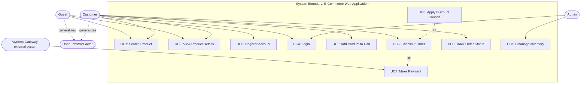

# Requirements Engineering — Complete Reference Guide

A structured Q&A documentation covering Requirements Engineering, Business Requirements, Elicitation, User Stories, Use Cases, Functional/Non-Functional Requirements, Requirements Review, and Requirements Reuse — with reusable templates and worked examples.

---

## Table of Contents

1. [Requirements Engineering — Concepts](#1-requirements-engineering--concepts)
2. [Business Requirements](#2-business-requirements)
3. [Requirements Elicitation](#3-requirements-elicitation)
4. [User Stories](#4-user-stories)
5. [Use Cases](#5-use-cases)
6. [Functional & Non-Functional Requirements](#6-functional--non-functional-requirements)
7. [Requirements Review](#7-requirements-review)
8. [Requirements Reuse](#8-requirements-reuse)
9. [Additional Topics](#9-additional-topics)
10. [Appendix: Quick-Reference Templates](#10-appendix-quick-reference-templates)
11. [Glossary](#11-glossary)

---

## 1. Requirements Engineering — Concepts

### 1.1 Definition

**Requirements Engineering (RE)** is the disciplined, systematic process of discovering, analyzing, documenting, validating, and managing the needs, expectations, and constraints of stakeholders for a software system — so that the delivered product actually solves the right problem, for the right people, within the right constraints.

RE sits at the very start of the software lifecycle and forms the foundation on which design, development, testing, and deployment are built.

### 1.2 Why Requirements Engineering Is Necessary

- **Aligns technology with business intent** — translates vague business ideas into precise, buildable specifications.
- **Reduces cost of failure** — industry data (NIST, Standish Group) shows that a majority of defects (commonly cited as 56–82%) are introduced during the requirements/specification phase, and correcting a requirements defect after release can cost **20–22x more** than catching it during elicitation.
- **Prevents scope creep and rework** by setting a clear, agreed baseline.
- **Improves communication** between business stakeholders, analysts, developers, and testers.
- **Provides a measurable basis for acceptance** — requirements become the yardstick for testing and sign-off.
- **Supports compliance** in regulated industries (healthcare, finance, aerospace, etc.).

### 1.3 The Requirements Engineering Process (5 Core Stages)

| Stage | Purpose |
|---|---|
| **1. Feasibility Study** | Determine whether the project is worth pursuing |
| **2. Requirements Elicitation & Analysis** | Discover and refine stakeholder needs |
| **3. Requirements Specification** | Document requirements formally and unambiguously |
| **4. Requirements Verification & Validation** | Confirm requirements are correct, complete, and match real needs |
| **5. Requirements Management** | Track, control, and evolve requirements over time |

**Feasibility Study sub-dimensions:**

| Type | Checks |
|---|---|
| Technical | Do we have the tools, tech, and skills to build it? |
| Operational | Will it work within existing operations; is it usable? |
| Economic | Do benefits outweigh costs (cost-benefit analysis)? |
| Legal | Does it comply with laws, regulations, IP rights? |
| Schedule | Can it be delivered within the required timeline? |

### 1.4 Extended Task Breakdown (Detailed Lifecycle)

```
Inception → Elicitation → Elaboration → Negotiation → Specification → Validation → Requirements Management
```

| Task | What Happens |
|---|---|
| **Inception** | Understand the problem, identify who wants a solution, define the nature of the solution, establish communication channels |
| **Elicitation** | Gather raw requirements from stakeholders (see Section 3) |
| **Elaboration** | Refine, expand, and model the gathered requirements; build prototypes if needed |
| **Negotiation** | Resolve conflicting requirements; agree on scope, cost, schedule, priority |
| **Specification** | Produce the formal requirements document (BRD/SRS/user stories/use cases) |
| **Validation** | Confirm requirements are correct, complete, consistent, and testable (see Section 7) |
| **Requirements Management** | Handle change requests, versioning, and traceability across the project lifecycle |

### 1.5 Types of Requirements

| Type | Description |
|---|---|
| **Business Requirement** | High-level statement of organizational goals/why the project exists |
| **Stakeholder / User Requirement** | What a specific user group needs the system to do for them |
| **Functional Requirement** | What the system must do (features, behavior) |
| **Non-Functional Requirement** | How well the system must perform (quality attributes) |
| **Domain Requirement** | Rules derived from the application's business domain/industry |
| **System / Software Requirement** | Detailed technical requirement derived from user requirements |
| **Transition Requirement** | Temporary requirements needed only to move from current to future state (data migration, training) |

### 1.6 Verification vs. Validation

| | Verification | Validation |
|---|---|---|
| **Question answered** | "Are we building the product right?" | "Are we building the right product?" |
| **Focus** | Internal consistency, completeness, correctness of the requirements document | Alignment with actual stakeholder needs |
| **Methods** | Reviews, inspections, checklists, formal analysis | Prototyping, demos, user acceptance walkthroughs |

### 1.7 Common Challenges in RE

- Requirements are vague, incomplete, or contradictory
- Stakeholders don't know what they want, or disagree with each other
- Requirements change frequently (volatility)
- Poor documentation and traceability
- Communication gap between business and technical teams
- Time and budget pressure to skip proper elicitation/review

### 1.8 Key Artifacts Produced During RE

- Business Requirements Document (BRD)
- Software/System Requirements Specification (SRS/FRS)
- Use Case Specifications
- User Story Backlog
- Non-Functional Requirements Specification
- Requirements Traceability Matrix (RTM)

---

## 2. Business Requirements

### 2.1 Definition

**Business Requirements** are the high-level statements that describe **why** a project exists — the organizational goals, needs, and value a software solution must deliver. They describe the business outcome, not the technical solution.

### 2.2 Necessity of Business Requirements

- Provide a **clear vision** so all stakeholders align on why the project matters.
- Guide **investment decisions** — justify budget and resource allocation.
- Form the anchor from which functional and non-functional requirements are derived.
- Reduce the risk of building a technically correct product that fails to serve the business.
- Give a measurable definition of **project success**.

### 2.3 What Are Business Objectives?

Business objectives are the specific, measurable outcomes the organization wants to achieve through the project — e.g., "increase revenue by 15%," "reduce customer onboarding time to under 1 day," "achieve regulatory compliance by Q3." Every business requirement should trace back to at least one business objective.

### 2.4 What Are Stakeholder Needs?

Stakeholder needs are the expectations and pain points of the people/groups affected by or interested in the system (executives, end users, regulators, partners, support staff). They sit between abstract business objectives and concrete functional requirements — they answer "what does this group need from the solution to do their job or achieve their goal?"

### 2.5 Business Requirements Document (BRD) — Writing Structure

A standard BRD contains the following sections:

1. **Title Page** — project name, document title, author, date
2. **Table of Contents**
3. **Executive Summary** — brief overview of project, objectives, scope
4. **Project Objectives** — business goals with measurable targets
5. **Scope** — In-Scope and Out-of-Scope items
6. **Stakeholders** — list with roles and responsibilities
7. **Business Requirements** — the core list (functional & non-functional summarized)
8. **Regulatory / Compliance Requirements**
9. **Use Cases / User Stories** — high-level interaction scenarios
10. **Assumptions and Constraints**
11. **Acceptance Criteria**
12. **Traceability Matrix**
13. **Approval and Sign-Off**
14. **Appendices** — glossary, references, supporting material

### 2.6 Common Business Requirement Writing Template

| Field | Description |
|---|---|
| **BR-ID** | Unique identifier (e.g., BR-01) |
| **Requirement Statement** | "The system shall / organization shall..." |
| **Business Objective Supported** | The goal this requirement serves |
| **Priority** | High / Medium / Low |
| **Stakeholder(s)** | Who needs this |
| **Rationale** | Why this is needed |
| **Acceptance Criteria** | How success is measured |

### 2.7 Ten Example Business Requirements (Generic — Applicable to Any Software Project)

| BR-ID | Requirement Statement | Business Objective | Priority | Stakeholder(s) | Acceptance Criteria |
|---|---|---|---|---|---|
| BR-01 | The system shall automate manual/repetitive business processes to improve operational efficiency. | Increase efficiency | High | Operations Team | ≥30% reduction in manual processing time |
| BR-02 | The system shall provide secure authentication and authorization to protect business and customer data. | Protect data assets | High | Security/Compliance | No unauthorized access incidents in audit |
| BR-03 | The system shall generate reports and dashboards to support management decision-making. | Enable data-driven decisions | High | Executives/Management | Reports available on demand, accurate to source data |
| BR-04 | The system shall scale to support business growth and increased user/transaction volume. | Support growth | Medium | IT/Operations | System supports target user load without degradation |
| BR-05 | The system shall comply with applicable legal, regulatory, and industry standards. | Ensure compliance | High | Legal/Compliance | Passes compliance audit |
| BR-06 | The system shall reduce operational costs by minimizing manual effort and errors. | Cost reduction | Medium | Finance/Operations | Measurable cost savings within 1 year |
| BR-07 | The system shall improve customer satisfaction through a reliable, user-friendly experience. | Customer satisfaction | High | Customers/Support | CSAT score improvement post-launch |
| BR-08 | The system shall support integration with third-party systems/services used by the business. | Ecosystem interoperability | Medium | IT/Partners | Successful data exchange with named integrations |
| BR-09 | The system shall be accessible across multiple platforms (web, mobile, desktop) to reach more users. | Market reach | Medium | Business/Marketing | Functional parity across supported platforms |
| BR-10 | The system shall maintain audit trails and logs to support accountability and traceability of business transactions. | Governance & accountability | High | Compliance/Audit | All critical transactions logged and retrievable |

---

## 3. Requirements Elicitation

### 3.1 Definition

**Requirements Elicitation** is the process of discovering, gathering, and drawing out requirements from stakeholders, existing systems, documents, and the application domain. It is widely regarded as the most difficult, error-prone, and communication-intensive activity in requirements engineering.

### 3.2 Steps of the Elicitation Process

**General process:**
1. **Establish Objectives** — business goals, problem to be solved, constraints
2. **Understand Background** — organizational structure, application domain, existing systems
3. **Organize Knowledge** — identify stakeholders, prioritize goals, filter domain knowledge
4. **Collect Requirements** — stakeholder requirements, domain requirements, organizational requirements

**Practical step-by-step:**
1. Identify Stakeholders
2. Gather Requirements (via techniques below)
3. Prioritize Requirements (Must/Should/Could/Won't)
4. Categorize Feasibility (Achievable / Deferred / Impossible)

### 3.3 Elicitation Techniques — Overview

| Technique | Best Used When |
|---|---|
| Interviews | Deep, one-on-one insight needed from a specific stakeholder/SME |
| Surveys/Questionnaires | Need input from a large, geographically dispersed population |
| Brainstorming | Need many new/innovative ideas quickly |
| Facilitated Workshops (JAD) | Need rapid, structured agreement among many stakeholders |
| Observation (Ethnography) | Need to understand real, unspoken workflow behavior |
| Prototyping | Requirements are unclear; users need something tangible to react to |
| Use Case / Scenario Approach | Need to describe user-system interaction sequences |
| Document Analysis | Existing manuals, business plans, reports contain relevant information |

### 3.4 How to Conduct a Good Interview

**Steps:**
1. Read background material and understand the domain
2. Establish clear interview objectives (what you want to learn)
3. Decide who to interview (right expertise/credibility, not everyone)
4. Prepare questions in advance; share purpose/duration with interviewee
5. Conduct the interview
6. Review notes, disseminate findings, resolve discrepancies

**Types of Interviews:**

| Type | Description |
|---|---|
| Structured | Fixed set of questions asked in a specific order; easy to analyze, less flexible |
| Semi-Structured | Mix of predefined and spontaneous questions |
| Unstructured | Open, conversational, no fixed agenda; rich but harder to analyze |

**Do's:** plan ahead, ask open-ended questions, stay neutral/open-minded, give stakeholders a starting point (existing system, draft requirement, or question), be aware of organizational politics.

**Don'ts:** use jargon/buzzwords to impress, approach with pre-conceived answers, rely on a single interview for critical decisions.

**Interview Guide — Writing Structure:**

| Field | Content |
|---|---|
| Objective | What this interview aims to discover |
| Interviewee | Name, role, relevance |
| Date/Duration | |
| Opening Question | Context-setting question |
| Core Questions | 5–10 open-ended, non-leading questions |
| Follow-up Prompts | For each core question |
| Closing | Summary + next steps |
| Notes/Findings | Captured after the session |

### 3.5 How to Conduct a Good Survey / Questionnaire

**Design Principles:**
- Keep it **short** — respondents disengage from long surveys
- Prefer **closed-ended questions** (Yes/No, rating scales 1–5) for large samples; avoid vague open-ended questions
- **Group interrelated questions** so responses can be cross-analyzed
- Use a consistent **scoring scheme** (e.g., 1–5 Likert scale)
- Keep language neutral — avoid leading or loaded phrasing

**Question Structure Framework:**

| Type | Leads To |
|---|---|
| What | Facts |
| How | Process/discussion |
| Why | Deeper motivation |
| When | Timing/frequency of the problem |
| Could | Open possibilities (use sparingly — may yield low-value data) |

**Questionnaire — Writing Structure:**

| Section | Content |
|---|---|
| Purpose Statement | Why this survey exists, how data will be used |
| Screening Questions | Confirm respondent is relevant |
| Closed Questions | Scaled/multiple-choice, grouped by theme |
| Optional Open Question | One or two, at the end only |
| Demographic/Context Questions | Role, department, experience level |
| Thank-You / Contact Note | |

### 3.6 Relationship to User Stories & Use Cases

Interviews, workshops, and observation are **elicitation techniques** that produce raw requirement statements. **User Stories** (Section 4) and **Use Cases** (Section 5) are **documentation/modeling formats** used to structure and elaborate what was elicited into a form developers and testers can act on.

---

## 4. User Stories

### 4.1 Definition

A **User Story** is a short, simple description of a feature or requirement written from the perspective of the end user, focused on the value it delivers rather than technical implementation.

### 4.2 Standard Format

> **As a** [role/persona], **I want** [goal/feature], **so that** [benefit/reason].

### 4.3 Components of a Complete User Story

| Component | Purpose |
|---|---|
| **ID** | Unique reference (e.g., US-01) |
| **Title** | Short descriptive name |
| **Role** | Who wants this |
| **Want** | What they want to do |
| **Benefit** | Why they want it |
| **Acceptance Criteria** | Given/When/Then conditions that define "done" |
| **Priority** | High/Medium/Low or MoSCoW |
| **Story Points / Size** | Relative effort estimate |
| **Dependencies** | Related stories, if any |

### 4.4 INVEST Criteria (Quality Check for a Good User Story)

| Letter | Meaning |
|---|---|
| **I** — Independent | Can be developed/delivered without depending on other stories |
| **N** — Negotiable | Details can be discussed, not a rigid contract |
| **V** — Valuable | Delivers clear value to a user or the business |
| **E** — Estimable | Team can reasonably estimate the effort |
| **S** — Small | Fits within a single iteration/sprint |
| **T** — Testable | Has clear, verifiable acceptance criteria |

### 4.5 Common Writing Template

```
ID: US-XX
Title: <short name>
As a <role>, I want <feature>, so that <benefit>.

Acceptance Criteria:
Given <context/precondition>
When <action>
Then <expected result>

Priority: <High/Medium/Low>
Story Points: <n>
```

### 4.6 Five Example User Stories (Generic — Applicable to Any Software)

**US-01 — Account Registration**
> As a **new user**, I want to **create an account using my email and password**, so that **I can access personalized features of the system**.
- *Given* I am on the registration page, *When* I submit valid details, *Then* my account is created and a confirmation is sent.
- Priority: High | Story Points: 3

**US-02 — Secure Login**
> As a **registered user**, I want to **log in securely with my credentials**, so that **I can access my account and data**.
- *Given* I enter valid credentials, *When* I click "Login", *Then* I am authenticated and redirected to my dashboard.
- Priority: High | Story Points: 2

**US-03 — Search Functionality**
> As a **user**, I want to **search for content/items by keyword**, so that **I can quickly find what I'm looking for**.
- *Given* I enter a keyword, *When* I trigger a search, *Then* relevant, ranked results are displayed.
- Priority: High | Story Points: 5

**US-04 — Notifications**
> As a **user**, I want to **receive notifications about important updates**, so that **I stay informed without checking the system constantly**.
- *Given* a relevant event occurs, *When* the trigger condition is met, *Then* I receive a notification via my preferred channel.
- Priority: Medium | Story Points: 3

**US-05 — View Activity History**
> As a **user**, I want to **view a history of my past activity/transactions**, so that **I can track and verify what I have done in the system**.
- *Given* I navigate to my history page, *When* the page loads, *Then* a chronological, accurate list of my activity is displayed.
- Priority: Medium | Story Points: 3

---

## 5. Use Cases

### 5.1 Definition

A **Use Case** describes a sequence of interactions between an **actor** (user or external system) and the system to achieve a specific goal. It describes **what** the system does, not **how** it is implemented.

### 5.2 Use Case Diagram — Definition

A **Use Case Diagram** is a UML behavioral diagram that visually represents the functional scope of a system by showing actors, use cases, and the relationships between them.

### 5.3 Components of a Use Case Diagram

| Component | Symbol | Description |
|---|---|---|
| **Actor** | Stick figure | External entity (person, system, device) that interacts with the system |
| — Primary Actor | | Initiates the use case to achieve a goal |
| — Secondary Actor | | Assists the system in achieving the goal (e.g., external service) |
| **Use Case** | Oval | A discrete piece of functionality/goal |
| **System Boundary** | Rectangle | Defines the scope of the system being modeled |
| **Association** | Solid line | Connects an actor to a use case they participate in |

### 5.4 Include Relationship

**Definition:** A `<<include>>` relationship means the base use case **always** invokes the included use case as a mandatory part of its flow — it represents shared, reusable behavior.
**Example:** "Checkout Order" **includes** "Make Payment" — payment is always required to complete checkout.

### 5.5 Extend Relationship

**Definition:** An `<<extend>>` relationship means the extending use case is **optional/conditional** — it adds behavior to the base use case only under certain conditions, without the base case knowing about it by default.
**Example:** "Apply Discount Coupon" **extends** "Checkout Order" — only happens if the customer has a coupon.

### 5.6 Generalization Relationship

**Definition:** Generalization represents an **inheritance (is-a)** relationship — either between actors (a specialized actor inherits all use cases of a general actor) or between use cases (a specialized use case inherits and adds to a general one).
**Example:** "Customer" and "Guest" both **generalize from** the abstract actor "User" — both inherit the ability to browse/search products.

### 5.7 Sample Use Case Diagram — 10 Use Cases (Domain: E-Commerce Web Application)

**Actors:**
- **User** (abstract/general actor)
- **Guest** (generalizes User — unregistered visitor)
- **Customer** (generalizes User — registered, can purchase)
- **Admin** (independent primary actor)
- **Payment Gateway** (secondary/external system actor)



*(Note: this diagram uses Mermaid flowchart syntax as a UML-approximation; it renders visually in Mermaid-compatible viewers such as GitHub, VS Code, or Notion.)*

### 5.8 Use Case Descriptive Template

| Field | Description |
|---|---|
| Use Case ID | Unique ID |
| Use Case Name | Short goal-oriented name |
| Actors | Primary / Secondary |
| Description | One-line summary of the goal |
| Preconditions | What must be true before this use case starts |
| Postconditions | What is true after successful completion |
| Main Flow (Basic Flow) | Numbered step-by-step happy path |
| Alternate Flow | Valid variations of the main flow |
| Exception Flow | Error/failure handling |
| Includes | Mandatory included use cases |
| Extends | Optional extending use cases |
| Business Rules | Constraints that apply |

### 5.9 Full Use Case Descriptions (All 10)

---
**UC1 — Search Product**
- **Actors:** Guest, Customer
- **Description:** Allows a user to search the product catalog by keyword.
- **Preconditions:** User is on the platform (login not required).
- **Postconditions:** Matching products are displayed.
- **Main Flow:** 1) User enters a keyword. 2) System queries the catalog. 3) System displays ranked results.
- **Alternate Flow:** No results found → system suggests related terms.
- **Exception Flow:** Search service unavailable → system shows an error message.
- **Includes:** None | **Extends:** None

**UC2 — View Product Details**
- **Actors:** Guest, Customer
- **Description:** Allows a user to view full details of a selected product.
- **Preconditions:** UC1 completed or product link accessed directly.
- **Postconditions:** Product detail page displayed.
- **Main Flow:** 1) User selects a product. 2) System retrieves product data. 3) System displays details (price, images, description, stock).
- **Alternate Flow:** Product out of stock → system displays "Notify Me" option.
- **Exception Flow:** Product not found → system shows a 404/error page.
- **Includes:** None | **Extends:** None

**UC3 — Register Account**
- **Actors:** Guest
- **Description:** Allows a guest to create a new customer account.
- **Preconditions:** User is not already registered.
- **Postconditions:** New Customer account created and stored.
- **Main Flow:** 1) User provides name, email, password. 2) System validates input. 3) System creates account. 4) Confirmation sent.
- **Alternate Flow:** Email already registered → system prompts to log in instead.
- **Exception Flow:** Validation fails → system shows field-level error messages.
- **Includes:** None | **Extends:** None

**UC4 — Login**
- **Actors:** Customer, Admin
- **Description:** Authenticates a registered user or admin into the system.
- **Preconditions:** User has a valid account.
- **Postconditions:** User is authenticated and session created.
- **Main Flow:** 1) User enters credentials. 2) System validates credentials. 3) System grants access to role-based dashboard.
- **Alternate Flow:** Forgot password → password reset flow triggered.
- **Exception Flow:** Invalid credentials after repeated attempts → account temporarily locked.
- **Includes:** None | **Extends:** None

**UC5 — Add Product to Cart**
- **Actors:** Customer
- **Description:** Allows a customer to add a product to their shopping cart.
- **Preconditions:** Customer is logged in; product is in stock.
- **Postconditions:** Product added to cart; cart total updated.
- **Main Flow:** 1) Customer selects quantity. 2) Customer clicks "Add to Cart". 3) System updates cart.
- **Alternate Flow:** Item already in cart → system increments quantity.
- **Exception Flow:** Requested quantity exceeds stock → system caps at available stock and notifies user.
- **Includes:** None | **Extends:** None

**UC6 — Checkout Order**
- **Actors:** Customer
- **Description:** Allows a customer to finalize and place an order.
- **Preconditions:** Cart is not empty; customer is logged in.
- **Postconditions:** Order is created and payment processed.
- **Main Flow:** 1) Customer reviews cart. 2) Customer confirms shipping address. 3) System invokes payment (**include** UC7). 4) System creates order record and sends confirmation.
- **Alternate Flow:** Customer applies a coupon (**extend** UC8) before confirming.
- **Exception Flow:** Payment fails → order not created; customer notified to retry.
- **Includes:** UC7 (Make Payment) | **Extends by:** UC8 (Apply Discount Coupon)

**UC7 — Make Payment**
- **Actors:** Customer, Payment Gateway
- **Description:** Processes payment for an order via an external payment gateway.
- **Preconditions:** Checkout has been initiated (included from UC6).
- **Postconditions:** Payment is authorized/captured or declined.
- **Main Flow:** 1) System sends payment request to gateway. 2) Gateway processes transaction. 3) System receives confirmation and updates order status.
- **Alternate Flow:** Multiple payment methods offered (card, wallet, etc.).
- **Exception Flow:** Gateway timeout/decline → system shows retry/alternative payment option.
- **Includes:** None | **Included by:** UC6

**UC8 — Apply Discount Coupon**
- **Actors:** Customer
- **Description:** Allows a customer to apply a valid discount coupon during checkout.
- **Preconditions:** Customer has a coupon code; checkout is in progress.
- **Postconditions:** Order total is recalculated with discount applied.
- **Main Flow:** 1) Customer enters coupon code. 2) System validates code and eligibility. 3) System applies discount to order total.
- **Alternate Flow:** None.
- **Exception Flow:** Invalid/expired coupon → system displays error and does not apply discount.
- **Includes:** None | **Extends:** UC6

**UC9 — Track Order Status**
- **Actors:** Customer
- **Description:** Allows a customer to check the current status of a placed order.
- **Preconditions:** Customer has at least one existing order.
- **Postconditions:** Current order status displayed.
- **Main Flow:** 1) Customer navigates to "My Orders". 2) System retrieves order status. 3) System displays status (processing/shipped/delivered).
- **Alternate Flow:** Customer requests order cancellation.
- **Exception Flow:** Order not found → system shows an appropriate message.
- **Includes:** None | **Extends:** None

**UC10 — Manage Inventory**
- **Actors:** Admin
- **Description:** Allows an admin to add, update, or remove product inventory records.
- **Preconditions:** Admin is logged in with appropriate permissions.
- **Postconditions:** Inventory records are updated in the system.
- **Main Flow:** 1) Admin selects a product. 2) Admin updates stock/price/details. 3) System saves changes and updates catalog.
- **Alternate Flow:** Bulk update via file import.
- **Exception Flow:** Invalid data entered → system rejects update and shows validation errors.
- **Includes:** None | **Extends:** None

---

## 6. Functional & Non-Functional Requirements

### 6.1 Definitions

- **Functional Requirement (FR):** Defines **what** the system must do — specific features, behaviors, inputs, processing, and outputs.
- **Non-Functional Requirement (NFR):** Defines **how well** the system must perform — quality attributes such as performance, security, usability, reliability, scalability, maintainability, and portability.

### 6.2 Why Both Matter

A system can satisfy every functional requirement and still fail if it is slow, insecure, or unreliable. NFRs are what make a functionally correct system actually usable, trustworthy, and viable at scale — they often drive core architecture decisions more than functional requirements do.

### 6.3 Functional vs. Non-Functional — Comparison

| Aspect | Functional Requirement | Non-Functional Requirement |
|---|---|---|
| Answers | "What does the system do?" | "How well does the system do it?" |
| Examples | Login, search, checkout, reporting | Speed, security, availability, usability |
| Captured via | Use cases, user stories | Technical specs, quality metrics, SLAs |
| Testing | Functional/UAT testing | Performance, security, load testing |
| Visibility | Directly visible to users | Indirectly experienced, shapes overall experience |

### 6.4 Common Writing Template

| Field | Description |
|---|---|
| **ID** | FR-XX / NFR-XX |
| **Category** | (for NFR: Performance/Security/Usability/etc.) |
| **Statement** | "The system shall..." |
| **Priority** | High/Medium/Low |
| **Source** | Business requirement / stakeholder it traces to |
| **Acceptance Criteria** | Measurable condition for success |

### 6.5 Ten Example Functional Requirements (Generic — Applicable to Any Software)

| FR-ID | Requirement Statement | Priority |
|---|---|---|
| FR-01 | The system shall allow users to register an account using email/username and password. | High |
| FR-02 | The system shall allow registered users to log in and log out securely. | High |
| FR-03 | The system shall allow users to search for content/items using keywords and filters. | High |
| FR-04 | The system shall allow users to create, update, and delete their own data/records. | High |
| FR-05 | The system shall send email/notification alerts for key events (e.g., password reset, order confirmation). | Medium |
| FR-06 | The system shall allow administrators to manage user accounts and permissions. | High |
| FR-07 | The system shall generate reports based on user-defined date ranges and filters. | Medium |
| FR-08 | The system shall allow users to upload and manage file attachments. | Medium |
| FR-09 | The system shall provide a dashboard summarizing key metrics relevant to the user's role. | Medium |
| FR-10 | The system shall integrate with at least one external third-party service/API required by the business. | Medium |

### 6.6 Ten Example Non-Functional Requirements (Generic — Applicable to Any Software)

| NFR-ID | Category | Requirement Statement | Priority |
|---|---|---|---|
| NFR-01 | Performance | The system shall respond to user actions within 2 seconds under normal load. | High |
| NFR-02 | Security | All sensitive data shall be encrypted in transit (TLS) and at rest. | High |
| NFR-03 | Availability | The system shall maintain 99.9% uptime, excluding scheduled maintenance. | High |
| NFR-04 | Scalability | The system shall support at least a 3x increase in concurrent users without performance degradation. | Medium |
| NFR-05 | Usability | A new user shall be able to complete a core task without training, within 5 minutes. | Medium |
| NFR-06 | Reliability | The system shall recover from a failure and resume normal operation within 15 minutes. | High |
| NFR-07 | Maintainability | The codebase shall follow documented coding standards to allow a new developer to onboard within 1 week. | Medium |
| NFR-08 | Portability | The system shall function correctly on the latest two major versions of supported browsers/OS. | Medium |
| NFR-09 | Compliance | The system shall comply with applicable data protection regulations (e.g., GDPR, local data laws). | High |
| NFR-10 | Auditability | The system shall log all critical user and admin actions with timestamp and user ID for at least 12 months. | Medium |

---

## 7. Requirements Review

### 7.1 Definition

**Requirements Review** is a structured process of examining documented requirements before development begins (and whenever changes occur) to validate scope, catch gaps, ambiguity, and hidden assumptions, and confirm the team is "building the right thing."

### 7.2 What Is Under Review

- Business Requirements Document (BRD)
- Software Requirements Specification (SRS) / Functional Requirements
- Non-Functional Requirements
- Use Case Specifications and diagrams
- User Stories and acceptance criteria
- Wireframes/prototypes tied to requirements

### 7.3 Reviewer Roles

| Role | Responsibility in Review |
|---|---|
| **Business Analyst** | Confirms requirements accurately reflect stakeholder needs |
| **Product Owner / Business Rep** | Validates business value and scope alignment |
| **Development Lead / Architect** | Assesses technical feasibility and design impact |
| **QA / Test Lead** | Confirms testability and completeness for test-case design |
| **Compliance / Legal (if applicable)** | Confirms regulatory alignment |
| **End-User Representative** | Confirms real-world usability and correctness |

### 7.4 Review Methods

| Method | Description | Best For |
|---|---|---|
| **Informal Review** | Quick peer check, no formal process | Early drafts |
| **Walkthrough** | Author presents requirements; team gives feedback | Team alignment |
| **Inspection** | Formal, rule-based structured review with defined roles | Regulated/high-risk projects |

### 7.5 Requirements Review Checklist

- [ ] Is each requirement **clear and unambiguous**?
- [ ] Is the requirement set **complete** (no missing scenarios)?
- [ ] Are requirements **consistent** (no contradictions)?
- [ ] Is each requirement **correct** and traceable to a real need?
- [ ] Is each requirement **feasible** (technically, economically, legally)?
- [ ] Is each requirement **testable** (measurable acceptance criteria)?
- [ ] Is each requirement **prioritized**?
- [ ] Are requirements **traceable** to business objectives and to test cases?
- [ ] Are edge cases and exception flows addressed?
- [ ] Are compliance/regulatory needs addressed?

### 7.6 Review Finding Log — Template

| Finding ID | Requirement ID | Description of Issue | Severity | Raised By | Status | Owner | Resolution / Comments | Date Closed |
|---|---|---|---|---|---|---|---|---|
| F-01 | FR-05 | Notification channel not specified (email vs SMS) | Medium | QA Lead | Open | BA | | |
| F-02 | NFR-01 | Response time target not defined for peak load | High | Architect | Resolved | BA | Updated to specify peak-load target | 2026-XX-XX |

### 7.7 Requirements Traceability Matrix (RTM)

**Definition:** An RTM is a table that maps each requirement to its origin (business need) and its downstream artifacts (design, code, test cases), ensuring nothing is lost, duplicated, or left unverified.

**Template:**

| Req ID | Requirement Description | Business Objective | Design/Component Ref | Test Case ID | Status |
|---|---|---|---|---|---|
| FR-01 | User registration | BR-07 | AuthModule-01 | TC-101 | Passed |
| NFR-02 | Data encryption | BR-02 | SecurityLayer-01 | TC-205 | In Progress |

### 7.8 Review Outcomes

| Outcome | Meaning |
|---|---|
| **Approved** | Requirement is clear, correct, and ready to be baselined |
| **Approved with Comments** | Minor changes needed but not blocking |
| **Rejected / Needs Rework** | Significant gaps; must be revised and re-reviewed |
| **Deferred** | Valid but out of current scope/phase |

Once approved, requirements are **baselined** — locked as the reference point for design, development, and testing; further changes go through formal change control.

### 7.9 Requirements Review: Agile vs. Traditional

| Aspect | Agile | Traditional |
|---|---|---|
| Timing | Continuous, before each sprint/story | Fixed phase-gate before development |
| Scope | Small — user stories & acceptance criteria | Large — full requirement documents |
| Style | Collaborative discussion during backlog refinement | Formal meetings with defined approvals |
| Detail Level | Just enough for near-term work | High detail for long project timelines |
| Change Handling | Continuous review/adjustment | Formal re-review and approval |
| Key Benefit | Fast feedback, early correction | Strong control, audit readiness |

### 7.10 Step-by-Step Review Process

1. **Prepare Requirements** — consolidate and ensure they are ready for evaluation (not raw notes).
2. **Identify the Right Review Group** — BA, dev, QA, PM, business owner, compliance as relevant.
3. **Choose Review Method** — informal, walkthrough, or inspection.
4. **Conduct Review Meeting(s)** — evaluate against the checklist (Section 7.5).
5. **Capture Feedback and Update Requirements** — log all findings (Section 7.6).
6. **Approve and Baseline** — sign off and lock the approved version as the reference for design/build/test.

---

## 8. Requirements Reuse

### 8.1 Definition

**Requirements Reuse** is the practice of applying previously created, validated requirements (or requirement sets) to new projects or products instead of rewriting them from scratch — saving time, improving quality, and maintaining consistency.

### 8.2 What Makes a Requirement a Good Candidate for Reuse

- It is **stable** and unlikely to change often (e.g., login, password reset, audit logging)
- It is **generic/domain-independent** rather than tied to one specific product
- It has already been **validated and tested** in production
- It is **modular** — self-contained, with clear inputs/outputs
- It relates to **compliance/regulatory standards** common across projects (e.g., data privacy, accessibility)

### 8.3 Reuse Layers / Levels

| Layer | Description | Example |
|---|---|---|
| **1. Application / Product-Family Level** | An entire application or product line is reused, unchanged or lightly adapted | Reusing a full CMS across multiple client sites |
| **2. Subsystem / Component / Module Level** | A self-contained subsystem or component is reused | Reusing an authentication module across products |
| **3. Object / Function / Procedure Level** | Small, discrete pieces of logic are reused | A reusable "validate email format" function |
| **4. Pattern / Template Level** | Reusing solution concepts rather than code — design patterns, requirement templates, compliance checklists | ISO 26262 compliance requirement template reused across automotive projects |

### 8.4 Benefits of Reuse

- **Time efficiency** — pre-validated requirements reduce administrative and review overhead
- **Improved quality** — reused requirements have already been tested and refined
- **Cost savings** — reduces redundant analysis and review effort
- **Consistency & compliance** — standardizes how common needs (security, logging, etc.) are expressed
- **Easier collaboration** — a shared requirement library aligns teams working on related products

### 8.5 Downsides / Risks of Reuse

- **Increased maintenance cost** — changes to a shared/reused requirement can ripple across many products
- **Obsolescence risk** — reused components/requirements may become outdated
- **"Not Invented Here" resistance** — teams may resist adopting requirements they didn't author
- **Overhead of managing a reuse library** — cataloguing, tagging, and governance take effort
- **Time cost of selection** — finding and evaluating the right reusable requirement takes time too

### 8.6 Reuse Strategies

1. **Centralized Requirement Repository** — a shared library of validated, tagged requirements (with metadata: version, tags, applicable use cases).
2. **Synchronization Tools** — changes to a source requirement automatically propagate to reused copies, preserving traceability.
3. **Modular, Scalable Requirement Templates** — break complex requirements into reusable building blocks (e.g., a compliance checklist template adaptable to Agile or Waterfall).
4. **Comparison / Variance Tracking** — tools/processes to detect and reconcile differences between the library version and the project-specific implementation.
5. **Governance Policies** — defined approval workflows, naming conventions, and ownership roles (e.g., a "Reuse Manager") to control how and when requirements are reused or modified.
6. **Reusing Test Cases** — pairing reused requirements with their already-validated test cases increases traceability and reduces duplicate QA effort.

### 8.7 Typical Reuse Process

1. Identify a candidate requirement/module from a completed project.
2. Assess suitability (stability, genericness, validation status).
3. Store/tag it in a centralized repository with metadata.
4. Pull it into a new project; adapt minimally if needed.
5. Track/synchronize any changes back to the source (or document the divergence).
6. Re-validate in the new context before baselining.

---

## 9. Additional Topics

*(Topics not explicitly asked, but essential to round out a complete requirements engineering reference.)*

### 9.1 Requirements Management

The ongoing discipline of tracking, controlling, and evolving requirements after they're baselined:
- **Change Control** — formal process to propose, assess impact of, approve/reject, and implement requirement changes.
- **Version Control** — maintaining historical versions of requirement documents.
- **Baselining** — freezing an approved requirement set as the official reference point.
- **Impact Analysis** — assessing how a proposed change affects other requirements, design, and test cases (enabled by the RTM).

### 9.2 Requirements Prioritization — MoSCoW Technique

| Category | Meaning |
|---|---|
| **Must Have** | Non-negotiable; system fails without it |
| **Should Have** | Important but not vital for initial release |
| **Could Have** | Desirable, included only if time/budget allows |
| **Won't Have (this time)** | Explicitly out of scope for the current phase |

### 9.3 Validation vs. Verification (Recap)

- **Verification** = confirming the requirements document itself is correct, consistent, and complete.
- **Validation** = confirming the requirements genuinely reflect what stakeholders need.

### 9.4 Common Requirements Documents — Quick Overview

| Document | Purpose |
|---|---|
| **BRD** (Business Requirements Document) | High-level business goals and scope |
| **SRS / FRS** (Software/Functional Requirements Specification) | Detailed functional and non-functional requirements |
| **PRD** (Product Requirements Document) | Product-level feature definition, often used in Agile/product teams |
| **Use Case Specification** | Detailed actor-system interaction scenarios |
| **User Story Backlog** | Agile-style prioritized list of user-value features |
| **RTM** (Requirements Traceability Matrix) | Maps requirements to design, code, and test artifacts |

### 9.5 Do's and Don'ts for Writing Any Requirement

**Do:**
- Use clear, active voice ("The system shall...")
- Make each requirement atomic (one requirement, one idea)
- Make it testable/measurable
- Assign a unique ID and priority
- Trace it back to a business objective or stakeholder need

**Don't:**
- Use vague/subjective words ("fast," "user-friendly," "robust") without a measurable definition
- Combine multiple requirements into a single sentence
- Describe implementation/design instead of need ("shall use MySQL" instead of "shall persist data reliably")
- Leave requirements unreviewed or untraceable

---

## 10. Appendix: Quick-Reference Templates

**Business Requirement**
```
BR-ID | Requirement Statement | Business Objective | Priority | Stakeholder(s) | Acceptance Criteria
```

**Functional / Non-Functional Requirement**
```
ID | Category (NFR only) | "The system shall..." | Priority | Source | Acceptance Criteria
```

**User Story**
```
As a <role>, I want <feature>, so that <benefit>.
Given <context>, When <action>, Then <result>.
Priority: | Story Points:
```

**Use Case**
```
ID | Name | Actors | Description | Preconditions | Postconditions |
Main Flow | Alternate Flow | Exception Flow | Includes | Extends
```

**Review Finding**
```
Finding ID | Requirement ID | Issue | Severity | Raised By | Status | Owner | Resolution | Date Closed
```

**Traceability Matrix Row**
```
Req ID | Description | Business Objective | Design Ref | Test Case ID | Status
```

---

## 11. Glossary

| Term | Definition |
|---|---|
| **Actor** | A person or external system that interacts with the system being modeled |
| **Baseline** | An approved, frozen version of requirements used as the reference point |
| **BRD** | Business Requirements Document |
| **Elicitation** | The process of discovering requirements from stakeholders and other sources |
| **FR / NFR** | Functional Requirement / Non-Functional Requirement |
| **INVEST** | Quality checklist for user stories (Independent, Negotiable, Valuable, Estimable, Small, Testable) |
| **MoSCoW** | Prioritization technique: Must/Should/Could/Won't have |
| **RTM** | Requirements Traceability Matrix |
| **SRS** | Software/System Requirements Specification |
| **Stakeholder** | Any person or group with interest in or influence over the system |
| **Use Case** | A description of a goal-oriented interaction between an actor and the system |
| **Validation** | Confirming requirements meet actual stakeholder needs |
| **Verification** | Confirming requirements are internally correct, complete, and consistent |

---

*Document compiled as a consolidated Requirements Engineering reference guide, synthesizing standard industry practices and terminology.*
